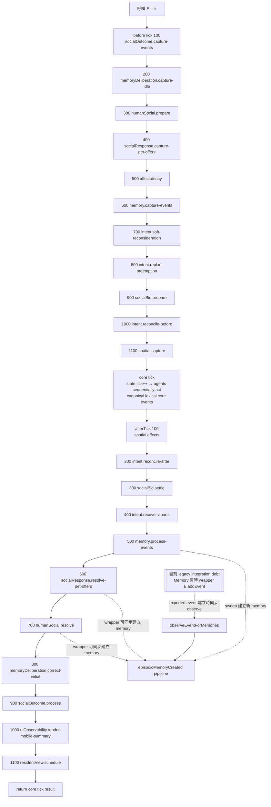
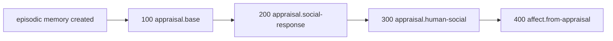

# Tick Pipeline — Current Runtime Ordering Contract

本文件記錄目前 `main` 的**實際 runtime hook 順序**。它不是理想化流程，也不是版本 changelog；表內 phase / order / hook ID 以 `src/runtime-hook-pipeline.js` 與各 runtime 的 `registerRuntimeHook(...)` 為依據。

目前 runtime marker：`11.14.0-player-resident-view-debug-inspector`。

> 核心原則：hook order 只要會改變「同一 tick 內誰先看見什麼、誰先建立 Memory / Intent / response、誰能影響後續 deliberation」，就屬於 simulation semantics，不應當成普通重構細節。

## 1. 一個 `E.tick()` 的主流程



圖中的 `E.addEvent` Memory wrapper **不屬於正式 runtime-hook phase**；它是目前為了補足 event-observation window 而存在的 active integration debt，刻意以虛線旁路表示。

## 2. beforeTick

| Order | Hook ID | Owner | 主要責任 | 為什麼順序有語義 |
|---:|---|---|---|---|
| 100 | `socialOutcome.capture-events` | Social Outcome Memory | 保存本 tick requester-private outcome 掃描 marker | 必須早於可能產生 wait-end / response 的後續 lifecycle |
| 200 | `memoryDeliberation.capture-idle` | Memory → Deliberation | 記住 core 前真正 idle 的 Agent | afterTick 800 只應 correction 本來由 core 新做初始 deliberation 的 Agent |
| 300 | `humanSocial.prepare` | Human Social Response | 捕捉／發出 `talkOffer`、準備 responder | `talkOffer` 發生在 Memory marker 600 之前，因此目前依賴 `E.addEvent` wrapper 才不漏 generic observation |
| 400 | `socialResponse.capture-pet-offers` | Pet Response | 捕捉 core 前已達 interaction phase 的 pet offer | afterTick 600 只 settle 這批 pre-core snapshot |
| 500 | `affect.decay` | Affect | 將 current Affect decay 到即將進入的新 tick | core decision 讀到的是 decay 後的 current Affect |
| 600 | `memory.capture-events` | Episodic Memory | 保存 newest event marker | 定義 generic event sweep 的起點 |
| 700 | `intent.soft-reconsideration` | Deliberation | 一般 soft switch / hysteresis | 先於 emergency / hard replan，且在 core choice 之前完成 |
| 800 | `intent.replan-preemption` | Intent / Interruption | emergency preemption、open Intent replan、abort snapshot | hard interruption 在 core 執行前完成 |
| 900 | `socialBid.prepare` | Social Bid | waiting action injection、response provenance snapshot | 為 afterTick settlement 保留本 tick 之前的 responder/requester 狀態 |
| 1000 | `intent.reconcile-before` | Active Intent | Action ↔ Intent linkage 收斂 | core tick 前避免 live Action / Intent linkage 漂移 |
| 1100 | `spatial.capture` | Spatial Effects | 保存 core 前位置與 event snapshot | afterTick 100 用來判斷本 tick movement / spill effects |

## 3. Core tick

Runtime pipeline 只呼叫 canonical core `tick()` **一次**。

Core tick 內部先推進 `state.tick`，再依序讓 Agent 執行自己的 Action / decision。這裡建立的 lexical core events 不會經過後來被 Memory 包住的 exported `E.addEvent`，所以現行 generic Memory 主要靠 afterTick 500 的 marker sweep 看見它們。

這一段必須保持為同一個明確 checkpoint：若把 core lexical event 改成 event-created 時立即觸發全部 Memory → Appraisal → Affect，後執行 Agent 可能在同一 core tick 提前讀到舊 runtime 原本還不可見的心理 state，會改變 emergent decision semantics。

## 4. afterTick

| Order | Hook ID | Owner | 主要責任 | 為什麼順序有語義 |
|---:|---|---|---|---|
| 100 | `spatial.effects` | Spatial Effects | 根據 pre-core snapshot 套用 movement / contact / spill 衍生效果 | 要先把物理結果寫回世界，再讓後續 lifecycle 看到正式 world state |
| 200 | `intent.reconcile-after` | Active Intent | core Action 結果後先收斂 Intent linkage | 後續 Social Bid / abort recovery 應讀一致 linkage |
| 300 | `socialBid.settle` | Social Bid | annotate new bids/responses、promote response Intent、timeout | same-tick response-before-timeout 的主要 ordering contract |
| 400 | `intent.recover-aborts` | Intent / Interruption | 從本 tick abort event 恢復仍有效的 open Intent | 必須在 generic Memory process 前完成本 tick interruption lifecycle |
| 500 | `memory.process-events` | Episodic Memory | 掃描 beforeTick 600 marker 後的新 canonical events | 定義 generic Memory sweep 的終點；600/700 social response 已在此之後，因此目前需 wrapper |
| 600 | `socialResponse.resolve-pet-offers` | Pet Response | 建立 `petOffer / acceptPet / toleratePet / avoidPet / petCat` | 事件在 Memory sweep 後建立；現況同一步內靠 `E.addEvent` wrapper 形成 Memory/Appraisal/Affect |
| 700 | `humanSocial.resolve` | Human Social Response | 建立 `acceptTalk / briefTalkReply / declineTalk / talk` | 同樣位於 sweep 後，且結果需在 800 前可被目前心理層看見 |
| 800 | `memoryDeliberation.correct-initial` | Memory → Deliberation | 修正本 tick core 初始 social target / utility choice | 因此 600/700 的 psychological update 若延後到 800 之後會改變現況 |
| 900 | `socialOutcome.process` | Requester Social Outcome | 建立 requester-private `privateSocialOutcome` | 這是 private experience path，不是 generic observable Memory sweep |
| 1000 | `uiObservability.render-mobile-summary` | Presentation | 更新 mobile derived summary | presentation-only；不得回寫 simulation truth |
| 1100 | `residentView.schedule` | Presentation | 排程 Resident View layering / render | presentation-only；不得影響 simulation ordering |

## 5. `episodicMemoryCreated` 支線

每當一筆新的 generic episodic memory 真正建立時，會同步進入另一條具名 pipeline：



| Order | Hook ID | Owner | 責任 |
|---:|---|---|---|
| 100 | `appraisal.base` | Appraisal | 建立 baseline / semantic appraisal |
| 200 | `appraisal.social-response` | Pet Response Appraisal | 覆蓋／補充 `avoidPet` 等 pet-response appraisal |
| 300 | `appraisal.human-social` | Human Social Appraisal | 處理 `acceptTalk / talk / briefTalkReply / declineTalk` |
| 400 | `affect.from-appraisal` | Affect | 由完成的 historical appraisal 更新 current Affect |

這條支線**不是 afterTick 固定第 N 步**。它何時發生，取決於是哪一條 observation path 建立了 memory：目前可能來自 `E.addEvent` wrapper，也可能來自 `memory.process-events` sweep。

## 6. afterReset

| Order | Hook ID | Owner | 責任 |
|---:|---|---|---|
| 100 | `intent.normalize-reset` | Active Intent | 收斂 Action ↔ Intent linkage |
| 200 | `socialBid.normalize-reset` | Social Bid | 初始化／清理 `observedSocialBids` |
| 300 | `memory.normalize-reset` | Episodic Memory | 初始化／dedupe／prune memory state |
| 400 | `affect.normalize-reset` | Affect | 正規化 current Affect |
| 500 | `memoryRetention.normalize-reset` | Memory Retention | 套用 bounded retention / salience cap |
| 600 | `uiObservability.reset` | Presentation | 重畫 mobile summary |
| 700 | `residentView.reset` | Presentation | 重設／排程 Resident View |

## 7. Memory event-observation window

現況仍是 hybrid model：

```text
exported E.addEvent
  └─ Memory wrapper → immediate observeEventForMemories

beforeTick 600 memory.capture-events
  ↓ marker
core tick + afterTick 100/200/300/400
  ↓
afterTick 500 memory.process-events
  └─ sweep marker 後的新 events
```

所以 event producer 目前分成：

- **pre-capture / wrapper-only**：例如 `humanSocial.prepare` 300 的 `talkOffer`。
- **capture → process / sweep-covered**：core lexical events、Spatial 100、部分 Social Bid / Intent events。
- **post-process / wrapper-only**：Pet response 600、Human response 700。
- **tick 外 direct `E.addEvent`**：focused Memory / Appraisal harness 現在也是同步 observation。

這也是為什麼目前不能直接刪 Memory 的 `E.addEvent` override。

## 8. 哪些 order 變更必須視為 semantic change

至少以下調整不得當成純 refactor：

1. `humanSocial.prepare` 穿越 `memory.capture-events` 600。
2. 任一 observable event producer 穿越 `memory.process-events` 500。
3. `socialBid.settle` 相對 requester timeout / response annotation 的位置改變。
4. Pet/Human response 600/700 與 `memoryDeliberation.correct-initial` 800 的相對位置改變。
5. Affect decay 移到 core tick 後，或 Appraisal/Affect 支線順序改變。
6. `intent.soft-reconsideration / replan-preemption / reconcile-before` 的相對順序改變。
7. presentation hook 提前進入 simulation hooks，或開始回寫 canonical state。

這些變更都應同步更新：

- 本文件；
- `tests/runtime-hook-pipeline.mjs`；
- 受影響 subsystem 的 focused timing regression；
- Notion Architecture / 相關 Current Design 權威頁。

## 9. Source of truth / regression

- runtime source of truth：各 subsystem 的 `registerRuntimeHook(phase, id, handler, order)`。
- registry：`E.listRuntimeHooks(phase)`。
- architecture guard：`tests/runtime-hook-pipeline.mjs` 應鎖定 simulation phases 的 `{ id, order }`，而不只鎖相對 ID 排列。
- full-app presentation tail 另由 Browser QA 驗證；simulation test harness 不載入 UI scripts，因此不應假裝 `1000/1100` 是 headless simulation hook。

若 source、regression 與本文件不一致，以 repo `main` source + regression 為準，並把文件視為 stale debt 立即修正。
