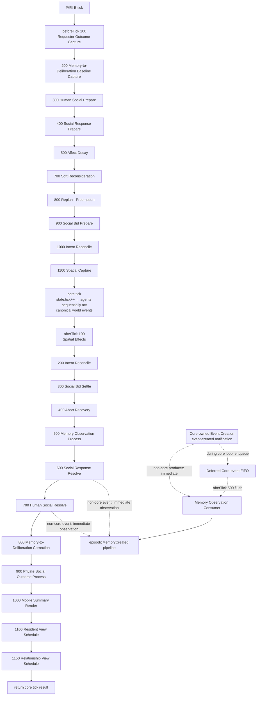
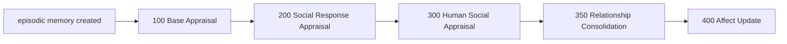

# Tick Pipeline — Current Runtime Ordering Contract

本文件記錄目前 `main` 的**實際 runtime hook 順序**。它不是理想化流程，也不是版本 changelog；表內 phase / order / hook ID 以 `src/runtime-hook-pipeline.js` 與各 runtime 的 `registerRuntimeHook(...)` 為依據。

目前 runtime marker：`11.15.0-relationship-foundation`。

> 核心原則：hook order 只要會改變「同一 tick 內誰先看見什麼、誰先建立 Memory / Relationship / Intent / response、誰能影響後續 deliberation」，就屬於 simulation semantics，不應當成普通重構細節。
>
> 表示層規則：**主流程圖描述 lifecycle responsibility，不把 implementation hook ID 或具體玩法動作當成架構階段名稱。** 精確 hook ID 只保留在 registry 表、source 與 regression；圖上的名稱應能在未來加入新互動類型時仍成立。

## 1. 一個 `E.tick()` 的主流程



主流程圖使用的是**責任名稱**；下方表格的 `Implementation Hook ID` 才對應實際 registry。兩者不可混為同一抽象層。

`E.addEvent` 現由 core 保持 ownership。Event-created notification 本身同步發出；Memory consumer 對非 core-loop producer 立即 observe，對 core-loop producer 則放入 ephemeral FIFO，於 afterTick 500 flush。沒有第二份 persistent World Event state。

## 2. beforeTick

| Order | Implementation Hook ID | Owner | 主要責任 | 為什麼順序有語義 |
|---:|---|---|---|---|
| 100 | `socialOutcome.capture-events` | Social Outcome Memory | 保存本 tick requester-private outcome 掃描 marker | 必須早於可能產生 wait-end / response 的後續 lifecycle |
| 200 | `memoryDeliberation.capture-idle` | Memory → Deliberation | 記住 core 前真正 idle 的 Agent | afterTick 800 只應 correction 本來由 core 新做初始 deliberation 的 Agent |
| 300 | `humanSocial.prepare` | Human Social Response | 捕捉／發出 `talkOffer`、準備 responder | 非 core-loop event 經 core event-created notification 同步形成合法 observation |
| 400 | `socialResponse.capture-pet-offers` | Social Response | 捕捉 core 前已達 interaction phase 的 response offer | afterTick 600 只 settle 這批 pre-core snapshot；hook ID 是 implementation detail，不代表 pipeline 架構綁死某一玩法 |
| 500 | `affect.decay` | Affect | 將 current Affect decay 到即將進入的新 tick | core decision 讀到的是 decay 後的 current Affect |
| 700 | `intent.soft-reconsideration` | Deliberation | 一般 soft switch / hysteresis | 先於 emergency / hard replan，且在 core choice 之前完成 |
| 800 | `intent.replan-preemption` | Intent / Interruption | emergency preemption、open Intent replan、abort snapshot | hard interruption 在 core 執行前完成 |
| 900 | `socialBid.prepare` | Social Bid | waiting action injection、response provenance snapshot | 為 afterTick settlement 保留本 tick 之前的 responder/requester 狀態 |
| 1000 | `intent.reconcile-before` | Active Intent | Action ↔ Intent linkage 收斂 | core tick 前避免 live Action / Intent linkage 漂移 |
| 1100 | `spatial.capture` | Spatial Effects | 保存 core 前位置與 event snapshot | afterTick 100 用來判斷本 tick movement / spill effects |

`memory.capture-events` / beforeTick 600 marker 已不再存在；Memory 不再掃 `state.events` 推斷哪些事件「剛發生」。

## 3. Core tick

Runtime pipeline 只呼叫 canonical core `tick()` **一次**。

Core tick 內部先推進 `state.tick`，再依序讓 Agent 執行自己的 Action / decision。Canonical event creator 仍是同一個 core `addEvent`；event-created notification 會標示 `duringCoreTick`。Memory 對這類事件只排入 runtime-local ephemeral FIFO，不在 Agent loop 中立即形成心理 state，並於 afterTick 500 統一 flush。

這一段必須保持為同一個明確 checkpoint：若把 core-loop event 改成 event-created 時立即觸發全部 Memory → Appraisal → Relationship → Affect，後執行 Agent 可能在同一 core tick 提前讀到舊 runtime 原本還不可見的 Agent-private state，會改變 emergent decision semantics。

## 4. afterTick

| Order | Implementation Hook ID | Owner | 主要責任 | 為什麼順序有語義 |
|---:|---|---|---|---|
| 100 | `spatial.effects` | Spatial Effects | 根據 pre-core snapshot 套用 movement / contact / spill 衍生效果 | 要先把物理結果寫回世界，再讓後續 lifecycle 看到正式 world state |
| 200 | `intent.reconcile-after` | Active Intent | core Action 結果後先收斂 Intent linkage | 後續 Social Bid / abort recovery 應讀一致 linkage |
| 300 | `socialBid.settle` | Social Bid | annotate new bids/responses、promote response Intent、timeout | same-tick response-before-timeout 的主要 ordering contract |
| 400 | `intent.recover-aborts` | Intent / Interruption | 從本 tick abort event 恢復仍有效的 open Intent | 必須在 Memory Observation Process 前完成本 tick interruption lifecycle |
| 500 | `memory.process-events` | Episodic Memory | FIFO flush core-loop event-created notifications | 保留 core event 在 Agent loop 結束後才形成 Memory/Appraisal/Relationship/Affect 的既有語義 |
| 600 | `socialResponse.resolve-pet-offers` | Social Response | settle captured response interaction，建立對應 world events | 非 core-loop event 經 event-created consumer 同步形成 Memory/Appraisal/Relationship/Affect；hook ID 只是目前 implementation owner |
| 700 | `humanSocial.resolve` | Human Social Response | settle Human social response，建立對應 world events | event-created consumer 同步 observe，結果仍在 800 前可被目前心理層看見 |
| 800 | `memoryDeliberation.correct-initial` | Memory → Deliberation | 修正本 tick core 初始 social target / utility choice | 因此 600/700 的 psychological update 若延後到 800 之後會改變現況 |
| 900 | `socialOutcome.process` | Requester Social Outcome | 建立 requester-private `privateSocialOutcome`，完成 Appraisal → Relationship → Affect / retention | 這是 private experience path，不是 generic observable World Event observation |
| 1000 | `uiObservability.render-mobile-summary` | Presentation | 更新 mobile derived summary | presentation-only；不得回寫 simulation truth |
| 1100 | `residentView.schedule` | Presentation | 排程 Resident View layering / render | presentation-only；不得影響 simulation ordering |
| 1150 | `relationshipView.schedule` | Presentation | 排程 Relationship readable/debug projection | presentation-only；不得影響 simulation ordering |

## 5. `episodicMemoryCreated` 支線

每當一筆新的 generic episodic memory 真正建立時，會同步進入另一條具名 pipeline：



| Order | Implementation Hook ID | Owner | 責任 |
|---:|---|---|---|
| 100 | `appraisal.base` | Appraisal | 建立 baseline / semantic appraisal |
| 200 | `appraisal.social-response` | Social Response Appraisal | 覆蓋／補充目前 response-specific appraisal |
| 300 | `appraisal.human-social` | Human Social Appraisal | 處理 Human social response appraisal |
| 350 | `relationship.consolidate` | Relationship | 對 audited direct relational evidence 以完成的 historical appraisal 更新 directional slow state；不符合 evidence gate 時 no-op |
| 400 | `affect.from-appraisal` | Affect | 由完成的 historical appraisal 更新 current Affect |

這條支線**不是 afterTick 固定第 N 步**。它何時發生取決於 Memory consumer 的 delivery：非 core-loop event 可同步建立 memory；core-loop event 則在 afterTick 500 FIFO flush 時建立。

`privateSocialOutcome` 是例外：目前不走 `episodicMemoryCreated` dispatcher，而由 requester-private path 建立 memory → appraise → 呼叫同一 `E.consolidateRelationshipFromMemory(...)` policy → Affect → prune。兩種 experience lifecycle 的統一是已記錄的 deferred architecture cleanup，不阻塞 Relationship Foundation。

## 6. afterReset

| Order | Implementation Hook ID | Owner | 責任 |
|---:|---|---|---|
| 100 | `intent.normalize-reset` | Active Intent | 收斂 Action ↔ Intent linkage |
| 200 | `socialBid.normalize-reset` | Social Bid | 初始化／清理 `observedSocialBids` |
| 300 | `memory.normalize-reset` | Episodic Memory | 清空 deferred FIFO，初始化／dedupe／prune memory state |
| 400 | `affect.normalize-reset` | Affect | 正規化 current Affect |
| 500 | `memoryRetention.normalize-reset` | Memory Retention | 套用 bounded retention / salience cap |
| 600 | `uiObservability.reset` | Presentation | 重畫 mobile summary |
| 700 | `residentView.reset` | Presentation | 重設／排程 Resident View |
| 750 | `relationshipView.reset` | Presentation | 重設／排程 Relationship projection |

Relationship persistent state 由 `relationship-schema-v1150.js` 的 initial-state layer 建立；目前不需要 simulation-level afterReset normalization hook。

## 7. Event-created / Memory observation lifecycle

PR #45 / #46 先把舊 hybrid wrapper + marker-sweep 的可見時點鎖成 deterministic baseline；目前正式 lifecycle 改為：

```text
core addEvent
  ├─ commit canonical event to state.events / state.causes
  └─ dispatch event-created notification
       ├─ outside core Agent loop → Memory observes synchronously
       └─ during core Agent loop  → Memory queues event reference
                                  ↓
                         afterTick 500 Memory Observation Process
                                  ↓ FIFO flush
                 Memory → Appraisal → Relationship → Affect
```

- **Event creation ownership**：`E.addEvent === E.CORE_ADD_EVENT`；Memory 不得再以 `E.addEvent = ...` 攔截 core API。
- **Listener contract**：Memory 使用具名 `memory.episodic-observation` event-created listener。Listener registry 是 runtime extension mechanism，不是 simulation state。
- **Non-core producers**：beforeTick / afterTick extension 與 tick 外 direct API 維持同步 observation；`event.tick` 作 creation-time provenance。
- **Core-loop producers**：event-created notification 仍在建立時發出，但 Memory 只 queue，不立即改 Agent-private state；FIFO 在 afterTick 500 flush，保留同 tick Agent sequential decision boundary。
- **Exactly once**：同一 source event 仍只產生一個 Agent-local episode；重複 delivery / re-observation 不得重複 Appraisal / Relationship consolidation / Affect。
- **Relationship gate**：Relationship hook 只對 audited direct relational evidence 生效；一般 episode 雖經同一 hook，也只 no-op，不把 `agency === other` 自動解讀成人際關係。
- **No persistent mirror**：deferred queue 是 Memory runtime-local ephemeral integration state，不寫入 canonical simulation state。
- **No marker sweep**：`memory.capture-events` 與 newest-event marker 已移除；Memory 不再掃 `state.events` 推斷「哪些事件剛發生」。
- **Private outcome remains separate**：`privateSocialOutcome` 仍是 requester-private experience path，不折進 generic World Event observation；它只可更新 requester 自己的 directional Relationship。

PR #45 / #46 的 timing regressions是這個 lifecycle 的 compatibility contract：tick 外 direct API、pre-core Human social offer、core-loop world event、Social Response Resolve 600、Human Social Resolve 700 都必須維持原有心理可見時點與 `event.tick → observedTick` provenance。Relationship Foundation 在這些既有心理 checkpoint 中插入 order 350 consolidation，不改 event delivery mode。

## 8. 哪些 order / boundary 變更必須視為 semantic change

至少以下調整不得當成純 refactor：

1. 任一 observable event producer 從 core-loop 移到非 core-loop（或反向），因為會改變 Memory delivery mode。
2. `Memory Observation Process` 500 相對 core tick / downstream decision hooks 的位置改變。
3. `Social Bid Settle` 相對 requester timeout / response annotation 的位置改變。
4. `Social Response Resolve` 600 / `Human Social Resolve` 700 與 `Memory-to-Deliberation Correction` 800 的相對位置改變。
5. Affect Decay 移到 core tick 後，或 Appraisal / Relationship / Affect 支線順序改變。
6. Relationship consolidation 被移到 historical Appraisal 完成前，或開始讀 Current Affect / raw event 推定關係。
7. Soft Reconsideration / Replan-Preemption / Intent Reconcile 的相對順序改變。
8. presentation hook 提前進入 simulation hooks，或開始回寫 canonical state。
9. event-created listener 開始持有第二份 persistent World Event truth，或 core `E.addEvent` ownership 被 extension 取代。
10. `privateSocialOutcome` 被誤改成 generic observable World Event memory，或 requester-private Relationship evidence 遠端更新 counterpart。

這些變更都應同步更新：

- 本文件；
- `tests/runtime-hook-pipeline.mjs`；
- 受影響 subsystem 的 focused timing / Relationship regression；
- Notion Architecture / 相關 Current Design 權威頁。

## 9. Source of truth / regression

- runtime source of truth：各 subsystem 的 `registerRuntimeHook(phase, id, handler, order)` 與 core event-created listener registration。
- hook registry：`E.listRuntimeHooks(phase)`。
- event-created consumer registry：`E.listEventCreatedListeners()`。
- architecture guard：`tests/runtime-hook-pipeline.mjs` 鎖 exact simulation hook ID / order，並拒絕 extension-owned lifecycle wrapper。
- Relationship causal guard：`tests/relationship-foundation-v1150.mjs` 鎖 directional ownership、audited evidence、private outcome boundary、exactly-once、Memory pruning independence 與 decision-inert contract。
- presentation hook / decorator 的 exact ordering 另由 presentation / browser regression 鎖定；它們不能被誤讀成 simulation pipeline stage。

若 source registry、focused regression 與本文不一致，以 current executable source + regression 為準，並在同一修正中同步本文；不得讓舊文件 ordering 反過來覆蓋現行已驗證 runtime。